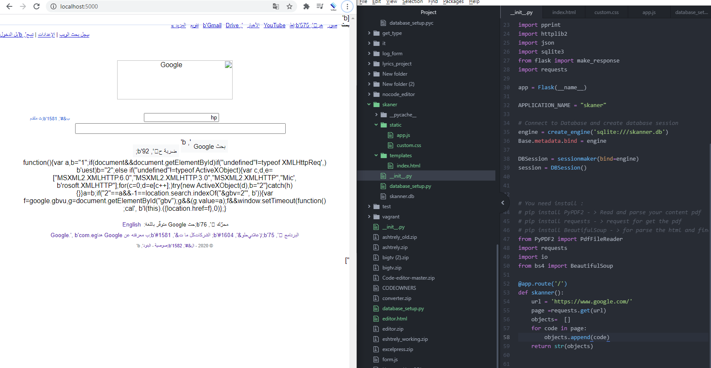

# Skanner_Scraper
Web Scraper Python3, create data reports, copy and paste website like google 

Stack Overflow, 

I could use libarary to extract element but i want to discover some ways to go deep in the data mining prepear for it
